## Kenyans In Texas User Manual

[TOC]

## 1. Introduction

### 1.1 About

KIT Online Classified advertisement system is web platform used to host, deliver and display classified adverts to target users. It involves email marketing, search engine marketing (SEM), social media marketing, display advertising i.e. web banner advertising, and mobile advertising. 

#### 1.1.1 Email Marketing

Email marketing is sending commercial email to target group of subscribers for the purpose of advertisements, sales, donations or content promotion. A successful email marketing campaign requires a strategy to increase the Return of investment. Email campaign strategy is a way of identifying and generating curated content for target demographic. It will involve segmentation,  personalization and response analysis.

#### 1.1.2 Search Engine Marketing

Search Engine marketing is process of increasing a website visibility in search engine results. This involves Search Engine Optimization to improve websites organic search rankings in search engine results pages (SERPS)  by increasing web content  relevance to search terms. Google Ad words is the most convenient way for advertisers to optimize and create campaigns since Google search is most used search engine.

#### 1.1.3 Social Media Marketing

Social media marketing is content promotion through social media websites. This can be done by posting frequent updates and providing special offers through their social media profiles. The content is mostly videos, interactive quizzes, and sponsored posts. Social media promotions are good source for organic traffic. The main social media platform are Facebook, Instagram and Twitter.

#### 1.1.4 Web Banner Advertising: *Re-targeting, Geo-tagging, Behavior targeting and Contextual advertising* 

Display advertising conveys its advertising message visually using text, logos, animations, videos, photographs, or other graphics. Display advertising is commonly used on social media, websites with slots for advertisements, and in real life. The goal of display advertising is to obtain more traffic, clicks, or popularity for the advertising brand or organization. Online advertisers use cookies, which are unique identifiers of specific computers, to decide which ads to serve to a particular consumer.  Re-targeting, geo-targeting, behavioral targeting, and contextual advertising is all are designed to increase an advertiser's return on investment, over un-targeted ads. Web banner advertising  graphical ads displayed within a web page. Many banner ads are delivered by a central ad server.

#### 1.1.5 Mobile Advertising

Mobile advertising is content promotion on smart phones, tablets or smart TVs by advertising within mobile websites or WAP, SMS, MMS. Most people access the Internet via smart phones and as such it offer best platform for content promotion. It is a great source of organic traffic and offers best option for targeted broadcasting. 

### 1.2 System Users

KIT Online web system is intended to be used by administrators, advertisers, publishers, and members.  Other participants include tracking bots specifically Search Engines, Google Analytics and Facebook Pixel who help in monitoring user activity, tracks statistics, and measure the effectiveness of advertising by understanding the actions people take on your website. 

#### 1.2.1 Administrator

The administrator has the highest exclusive access rights in the website content and users management. The administrator can add/remove administrators,  activate/deactivate/ban members, advertisers or publishers. Only the first administrator has unlimited rights and cannot be deleted. The administrator can access their user portal via https://kenyansintexas.co.ke/admin . All functions on these portal are fully described on the Administrator Portal section.

#### 1.2.2 Member

The members have the access rights to post, comment and like classified Ads. They can also comment and like blog posts. When a member registers they also subscribes for email notifications and receive notifications when their content is commented, liked, or shared on social media. Members have a minimal portal dashboard where the can manage their content and also update their profile content. 

#### 1.2.3 Advertiser

The advertisers provides the advertisements to be displayed on the publisher's content. Advertisers manage their advertisement and can track the click and impression on their dashboard. The full functionality of the the advertisement portal is described on Advertiser section.

#### 1.2.4 Publisher

The publishers integrates advertisements into their online content and thus can request to request withdraw funds accrued by clicks and impression on the content. The full functionality that publishers can access is described in the Publishers Portal section.

#### 1.2.5 Visitors

KenyansInTexas.co.ke domain is publicly accessible and anyone can access the website. All users who are not authenticated are considered visitors who makes the largest share of the traffic. They can access the homepage, blogs classified Ads, About section and all links publicly accessible. The content is crafted and published to attract as many visitors though search engine optimization and banner advertising.

## 2. How It Works (Summarized)

KenyansInTexas.co.ke is classified Ads website where members publish Ads that contains author member name, an image, Ad description, Ad link and Ad phone. The classified Ad post can be commented, liked, shared or reported. This post are search-optimized for search engines and can be target uniquely using HTML meta tags. The administrator can also publish blog posts to improve the search ranks of the website. The members who wish to promote the published Ads post via web banner advertising the create an advertising account and buy credit to promote their content. The content to promote is not necessarily only Ads posted on KenyansInTexas.co.ke but their own website. The traffic to these classified ads is increased and tracked. This has a return of value to the advertisers and members can market their content across the WWW web. Publishers who wish to earn by displaying web banners on their website can create an account and copy javascript link URL on their website.

### 2.1 Content Generation and Marketing

Content is king, and rules over rules over search rankings. The Internet was founded for the purpose of exchanging *content*. In order to feed the search engine *beast*  we have optimized and recommend the following guidelines to provide the most relevant to search result.

|                                                              |                                                              |
| ------------------------------------------------------------ | ------------------------------------------------------------ |
| **2.1.1 Publish Classified Advertisements that benefits target audience. Understanding who your audience is and what you want them to do when they click on your article will help guide your Blog strategy.** |  |
|  | **2.1.2 Use more targeted right keywords such as *'How to..'*, *'How do I'*  Repeat your keyword phrase several times throughout the page—once or twice in the opening and closing paragraphs, and two to four more times throughout the remaining content.** |
| **2.1.3 Use Images related to the Advertisement content. In order to achieve a coveted spot in an image pack or a video snippet, you’ll want to design creative graphics, use original photos and videos, and add descriptive alt text to every visual element within your *Blog* post.** |  |
|  | **2.1.4 Use Catchy title. A catchy title uses data, asks a question, or leads with curiosity to pique the reader’s interest.** |
| **2.1.5 Update Your Content Regularly. Regularly updated content is viewed as one of the best indicators of a site's relevancy, so be sure to keep it fresh** |             |

## 3. Homepage 

This is the public side of the system which can be accessed without authentication via login. This can be accessed by using browser by navigating to KIT domain https://kenyansintexas.co.ke. 

### 3.1 Home

This is the first page of the system that welcomes the user into the system. 

#### 3.1.1 Jumbotron section

This is the topmost section on the home page, which displays the logo, website name, and navigation buttons. The content can be modified on the Administrator portal.

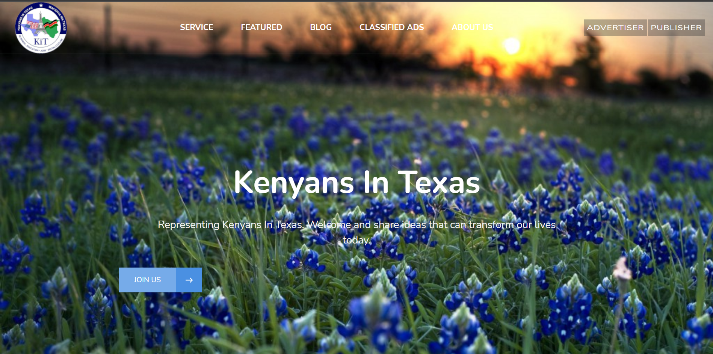

#### 3.1.2 Services section

This section displays below the jumbotron and show the service offered by the KIT platform. It also includes description for each service offered. The content can be modified on the Administrator page.

#### 3.1.3 Features section

This section displays below the Services and show the service offered by the KIT platform. It includes featured Blog post, classified ads or Features. The content can be modified on the Administrator page. If user clicks on any item on this slider it redirects to the actual page to view.

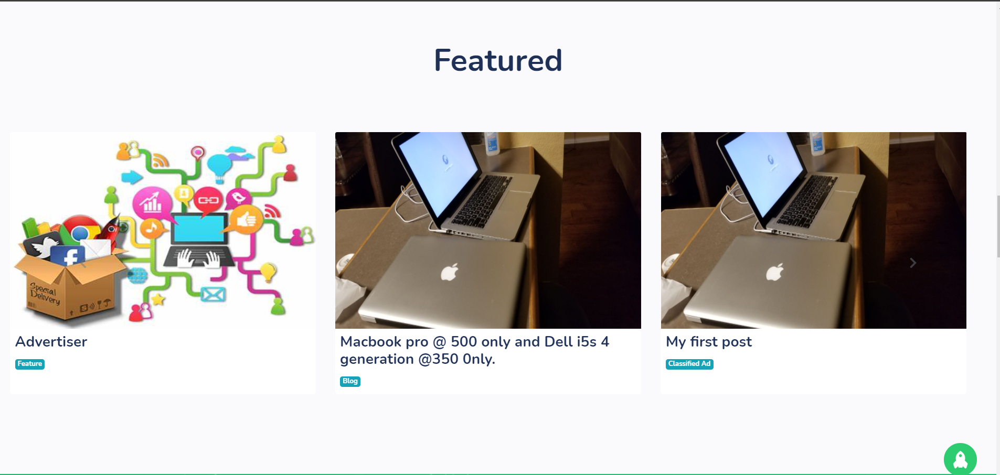

#### 3.1.3 About section

This section displays below the services section. It describes the using popup video about KIT service and any details related to main KIT business.

#### 3.1.4 Testimonials

This section displays below the about section and contains a slider of sampled testimonials from top KIT clients. The content can be modified on the Administrator page.

#### 3.1.5 Achievements

This section displays below the testimonials section. It contains the total numbers of achievements. The content can be modified on the Administrator page.

#### 3.1.6 Subscriber form

 This section include subscribers form. The user who uses this subscription is sent a email and notified by Administrator via email. The list of subscribers is available on the Administrator page.

#### 3.1.7 Footer

### 3.2. Blog

#### 3.2.1 List of latest blog posts

This page can be accessed by clicking on the `Blog` menu on the navigation bar. This page contains all blog posts that have been posted by the administrator in grid layout. Each post has an image and title to show the related information in that post. The blog post are paginated to only show 20 items on each page. The pagination links are below the grid layout. The user can click on either of the blog post and it will open on blog post detail page. Each blog post has a unique id and url slug to allow discovery in search engine optimization.

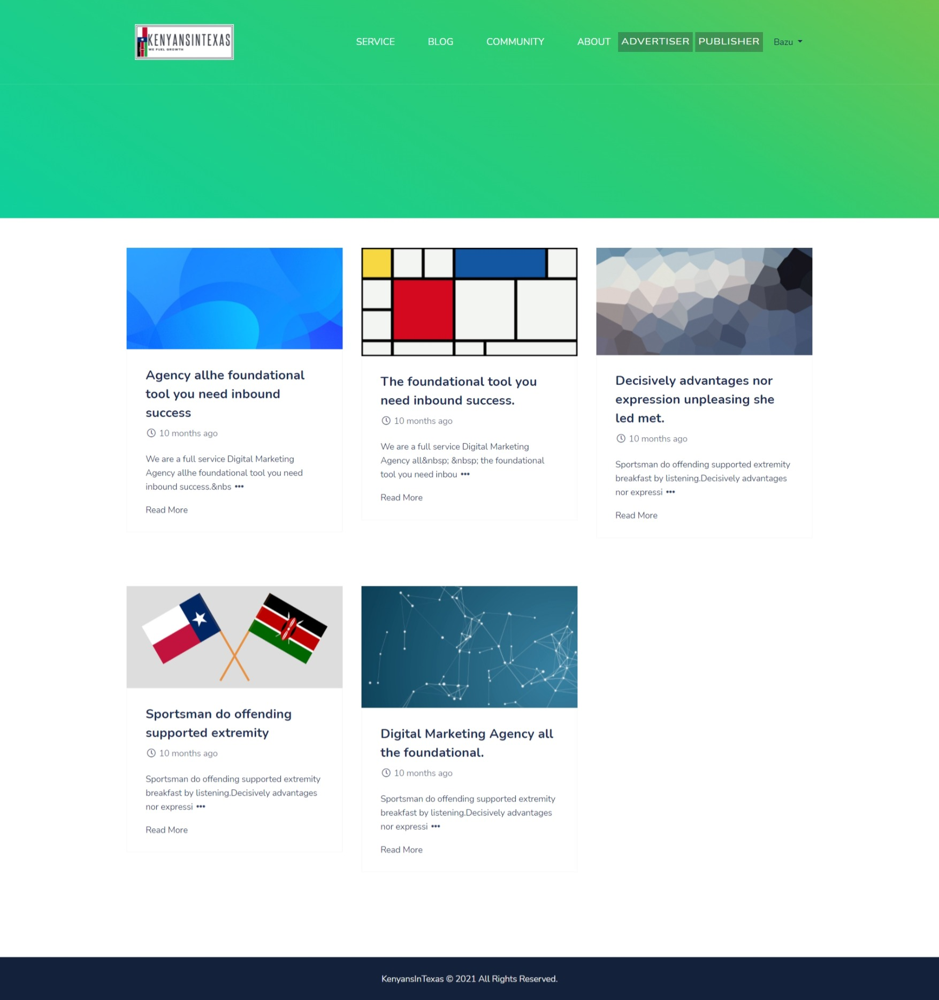

#### 3.2.2 Blog post

This page opens the selected blog post and displays the full blog content including the contents. A blog has a title, photo, body, author name, author date and review comments. A title is shown at the top of the page and it is used to generate the URL slug. The main body is composed of text, links and images. The review comment are visible to all user but only authenticated members can post a comment.   This page also contain these components: `search blogs`, `related blogs`, `archived blogs`, `categories`. A search component is used to search for other post with specific words. The results is shown in the list of blog posts. The related blog posts are click able and will open on their details page. Each blog has been categorized and thus using the categories blogs can be filtered to only related posts.

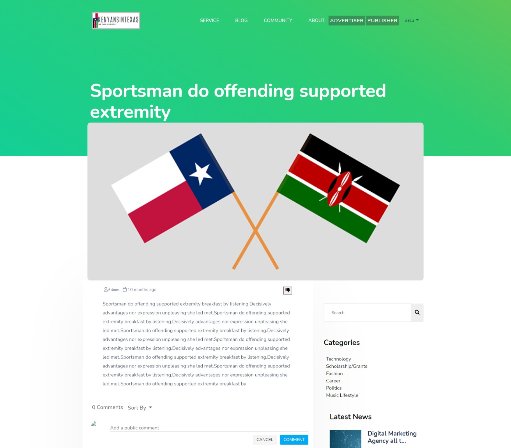

### 3.3 Classified Ads

The Section has a real-time classified for the registered members. The non authenticated members can still follow the feed but only the registered members can post, like or comment. To navigate to this page select the `community` menu on the navigation bar. This page contains the following sections: `Members' Posts`, `Post`, `Search a post`, `Filter posts links`, `login as member to post`, `pagination links`, and `Compose a post`.

#### 3.3.1 Members' Posts

This is the main section in this page, it contain a list of post, organized with most recent posts displayed first on the list. Only the first post shows expanded comments. These list is repeatedly  refreshed on the background to fetch all recent posts. When a new post or new comment for the first post is discovered, it is fetched and displayed on the feed. This list of posts contains individual post that are distinguished by each other by the title, content, name the member who and when posted.

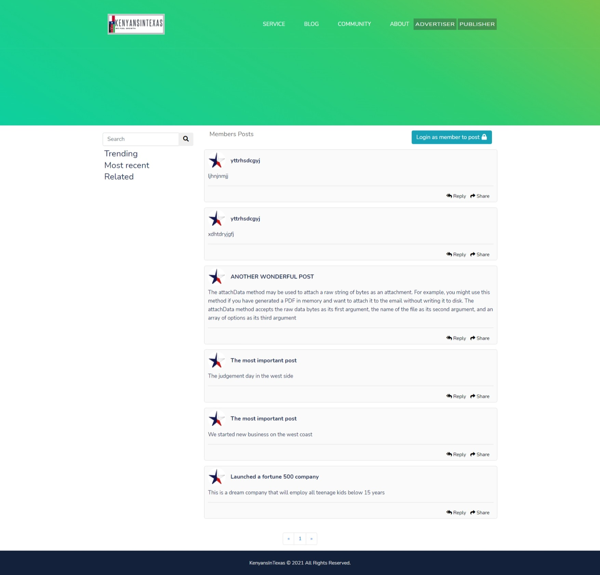 

#### 3.3.2 Post

A single post contains a title,content, member name, member display picture, posting time, reply comments, reply button, like button and share button. A title is short text to describe the post. Content can either be text, photo or a link. Member name and display picture author of the post who must be registered and verified. Posting time shows the time that has elapsed since the post was posted. Other members can either reply, like or share the post using the respective buttons. The like button will also display the number of times a post has been liked. The reply comment are displayed below each post. A user must be a member to reply a post otherwise it will not be posted.

 

#### 3.3.3 Search a Post

This component allows any user to search for a specific post using its text. The post will be search using title or content. The list of post is refreshed to show only post withe related words or if none was found the list will be blank and alert user none was found. 

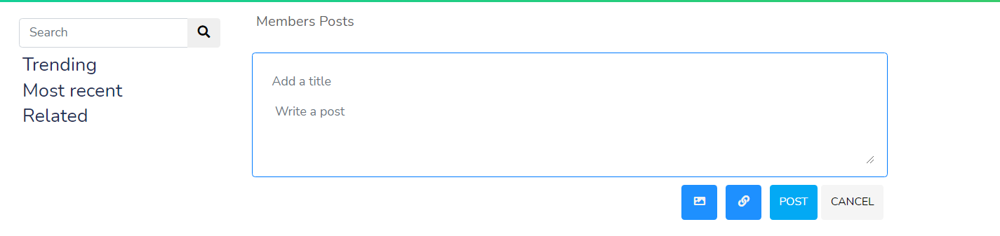 

#### 3.3.4 Filter post links

These links includes: trending, most recent, related. These are ways to organize the members post. By default the list of post is organized by  most recent. When trending is selected, the most liked and commented post are displayed first.

 

#### 3.3.5 Login as member to post button

This button redirects user to member login page where they provide `username` and `password` to be authenticated as registered members. This allows users who have been successfully authenticated to be able to perform members only actions such as replying, liking posts.   

 

Login Form

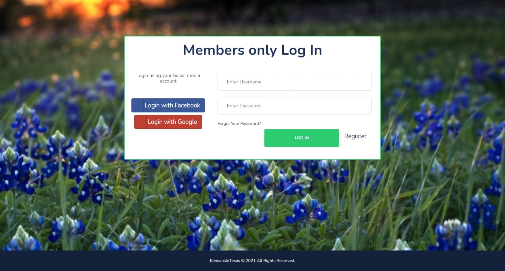

#### 3.3.6 Pagination links

The list of post can only display a maximum of 20 posts on the page. If the posts are more than these, which will eventually happen as the members continue posting, the posts are sub-divided into pages. The pagination links allows the users to manually fetch by navigating to next pages, specific page number or previous seen pages.  

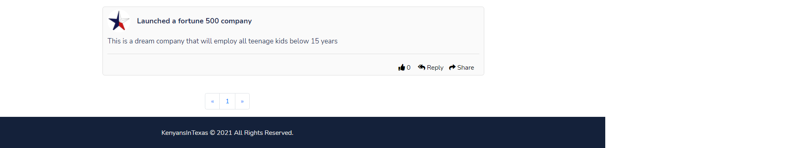 

#### 3.3.7 Compose a post

This component is hidden to user who have not been authenticated as members. When a user login and is successfully authenticated as a registered member they are able to see this component above the members' post. It contain a `Title input field`, `Content input field`,`Upload image button`, `Link upload button` and a `Post button` to create new post. When a post is created is displayed at the top of the members post and can be viewed by other users. 

 

### 3.4 About Page 

This page can be accessed by clicking on the navigation button `About` button. The page has 3 components a brief description of KIT website, contact form and frequently asked questions. 

#### 3.4.1 Description and Location

The description shows details that is shown in jumbotron section, contact links/location address on shown footer section and a link to the video URL in the about section in home page. 

#### 3.4.2 Contact form

If the user has a specific query they may either send the query using contact form and they need to include an email address for response. 

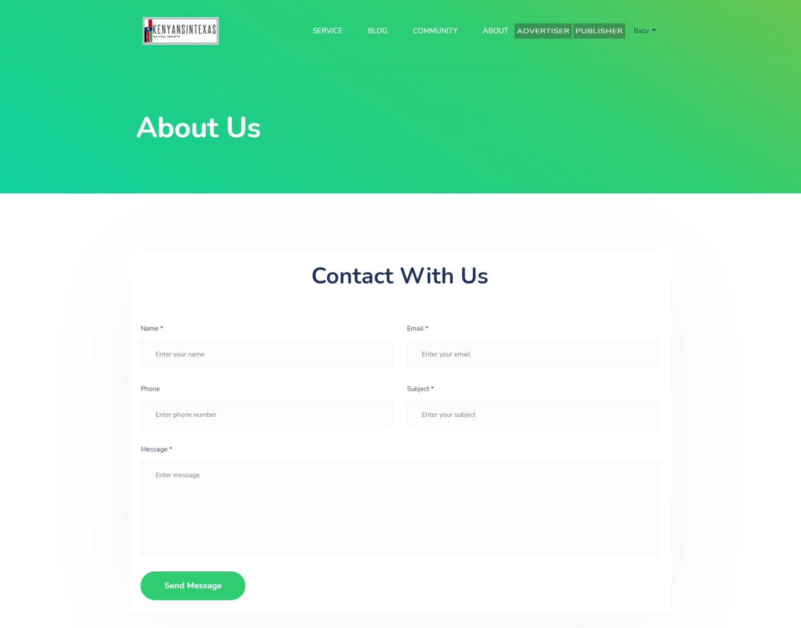

#### 3.4.3 Frequently Asked Questions

In case is frequently asked question, they should navigate below the contact form and expand the collapsed widgets to view most appropriate answers.

- 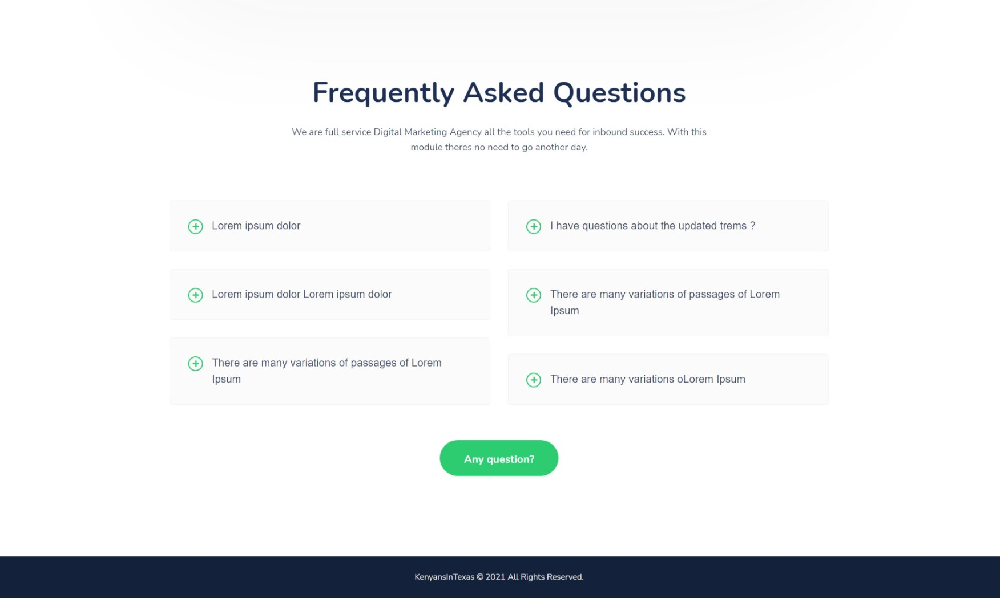  

## 4. Administrator Portal

This dashboard enables administrator and website manager to combine data from across web pages into one single analytics and management platform in order to track, create, update and display all aspects of the website. 

#### Login

The administrator has one login entry by add the `/admin` after the KenyansInTexas domain url. This will open below interface to login using `username` and `password`. There is a default admin but after login the administrator can add more administrators.

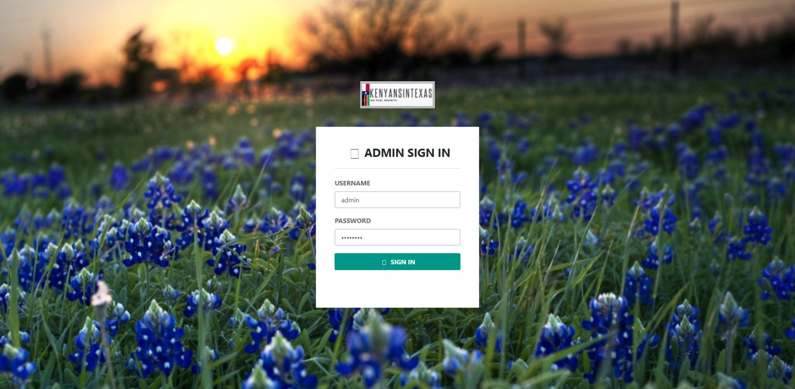

#### Create New Administrator

The administrator can add new administrator by selecting `Create New Admin` menu  on the right navigation bar drop down menu. This opens an interface to add `Name of Admin`, `Email of Admin`, `Username of Admin`, `New password` and `Confirm Password`. The values are saved by clicking on the `Create Admin` button. The new administrator can now login on the admin login.

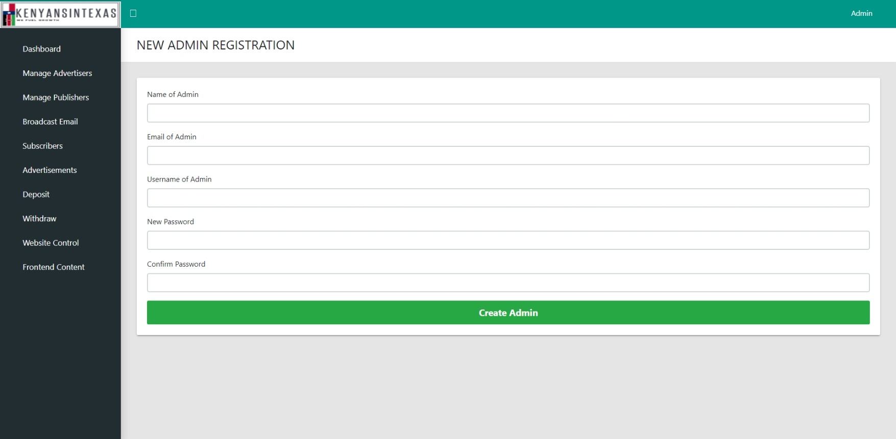

#### List of Administrator

This interface displays a tabular layout of all administrators created. The columns include `Name`, `Email`, `Username` and `Action` to edit or delete.

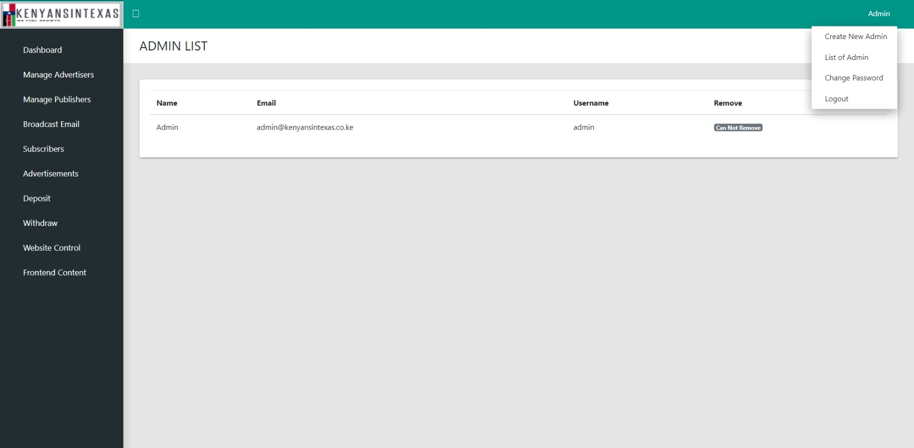

#### Change of Password

This interface allows the logged in administrator to change their password. They must also remember the `Old password`, before adding `New Password` and `Confirm the New Password`.

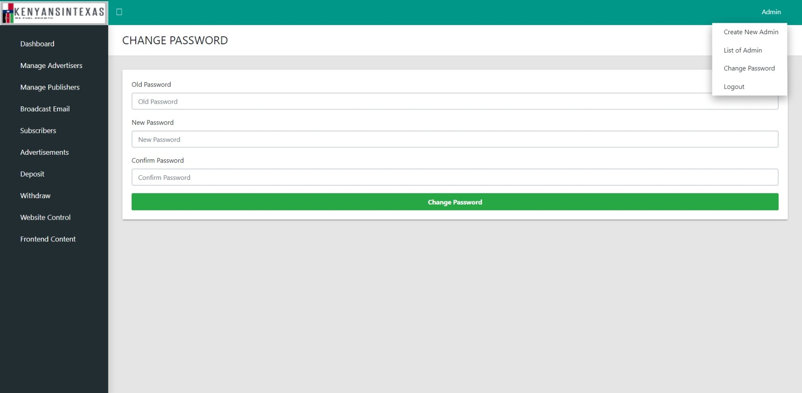

### 4.0 Dashboard Reports

A real-time dashboard is a tool used to track and display key performance indicators in order to analyze advertising and advertiser efforts over time and across multiple channels. It's also a marketing agency’s way of displaying the value of their work to their clients. 

The reports is display in graphical format that is easy to read at a glance. The metrics includes the `number of advertisers` and `number of publishers`, `withdraw requests from publishers`, `total amount deposited by advertisers`, `number of advertisements generated`, `total impressions or views`, and `total clicks on the advertisements`. 

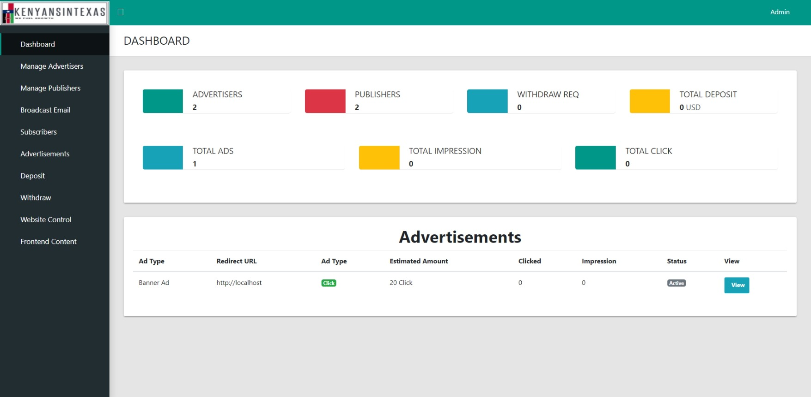

The second report displays advertisements created by advertisers including details of each advertisement in tabular format. The administrator can click on the view button to view the display image of the advertisement in a pop-up view 

### 4.1 Manage Advertisers

All advertising clients running campaigns via our Managed Services offering have access to our Real Time Advertiser Reporting Portal. As part of our onboarding process all advertisers are provide login access, prior to the campaign going live.

We know that advertisers need access to real-time performance data, so being able to access how one strategy is performing against another allows you as the advertiser to make informed decisions.

Updated every few minutes with the latest campaign information, you’ll see comprehensive and transparent data regarding all your campaigns running with us.

### 4.2 Manage Publishers

 Publishers sell space on their websites to earn money by displaying ads. The cost is usually based on two different pricing models either CPC (Cost per Click) or CPM (Cost per Mille) where mille refers to 1000 impressions. This interface shows a list of Publishers and list of banned publishers.

The list of registered publishers is displayed in tabular format and the columns include `Name`, `Email`, `Username` and `phone number`.  

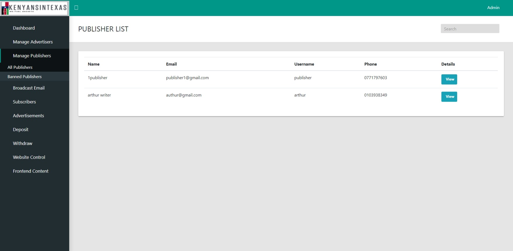

There is also a View button the end of each row. When clicked, it opens an interface that shows the details of the selected publisher or advertiser. The information can be updated by administrator or ban the user.

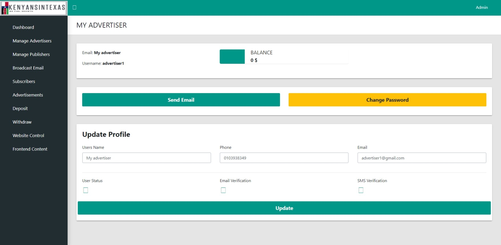

### 4.3 Broadcast Email

Broadcast email is a tool to compose filter and send email to the target users either for newsletter, acquisition, retention or promotional content.  In this interface, the administrator, can compose email to send and select the category of subscribers to send the email. Then need to create a common subject topic and compose a email using a template that can be designed by clicking Frontend content tab on the administrator dashboard then click on Emails and SMS templates. 

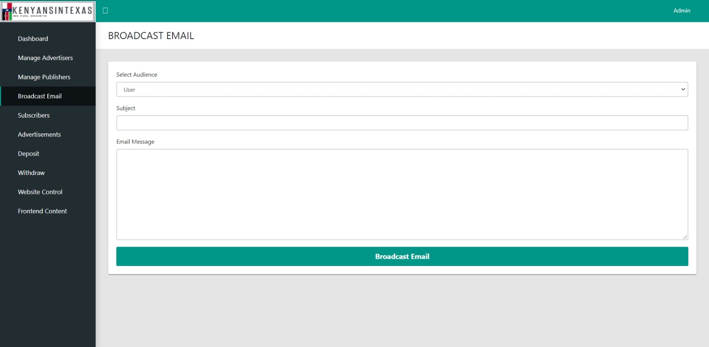

### 4.4 Subscribers/Members

The administrator is can view all the emails have subscribed to receive newsletter. In this interface, the administrator, can compose email to send all the emails have subscribed.

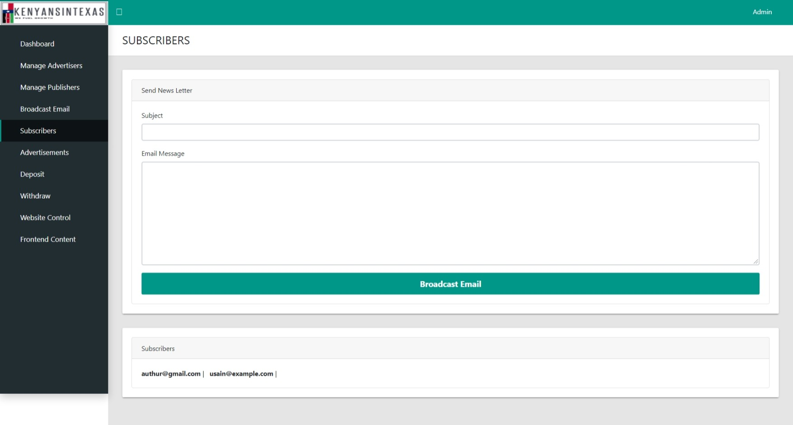

A list of subscribed Emails

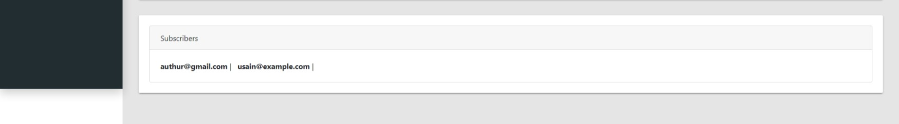

This interface also has list of all members who have registered in tabular layout. The table contains columns of  members including `name`, `email`, `phone`, `country of origin`, and `status`. 

There's a a View Button at the end of each row, to show, update and approve Member details.

### 4.5 Advertisements

#### 4.5.1 Advertisement Plans

This interface allows the administrator to create new or update advertisement plans. Advertisement plan is a strategy developed by the administrator to target specific category of advertiser or a specific period of time by regulating the price of each advert and type of advertisement allowed. This may favor or discourage some advertiser in order to regulate the product.   

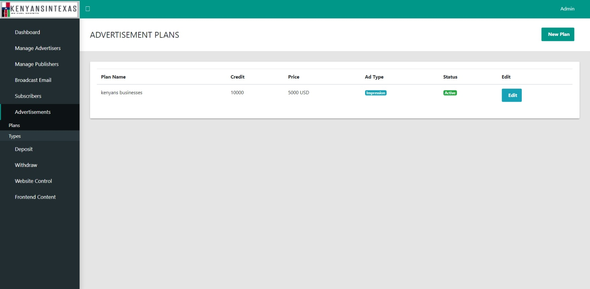

This interface show a tabular layout of the details of each advertisement create by the administrator. The columns include Plan name, Credit, Price, Ad type, status. There is a button at the end of each row to update the details of the plans.

There is a button on the right top of the above table, when clicked, it opens a pop-up view to create a new advertisement plan.

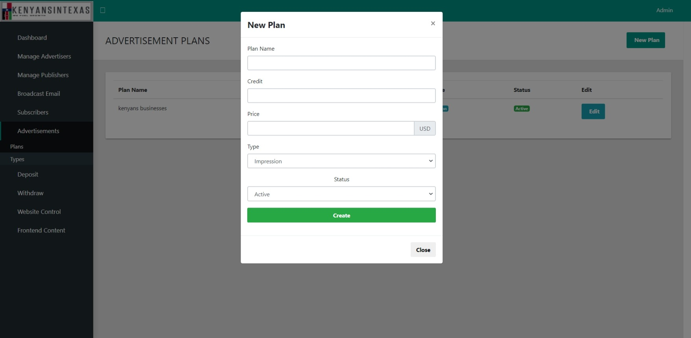

#### 4.5.2 Advertisement Types

This interface allows the administrator to create new or update advertisement types or banners adverts. Web banners, also known as banner ads or display ads, are digital advertisements displayed in the header, footer, or sidebars of websites, such as blogs and news publications. They’re generally considered an affordable type of online advertising with an average cost-per-click (CPC) and an average cost-per-thousand-impressions (CPM).  

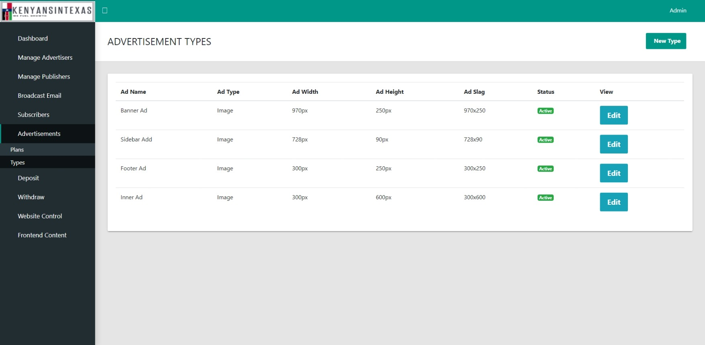

This interface show a tabular layout of the details of each type of banner ad created by the administrator. The columns include Ad name, Ad type, Ad Width, Ad height, Ad slag and Status. There is a button at the end of each row to update the details of the banner type.

There is a button on the right top of the above table, when clicked, it opens a pop-up view to create a new advertisement type.

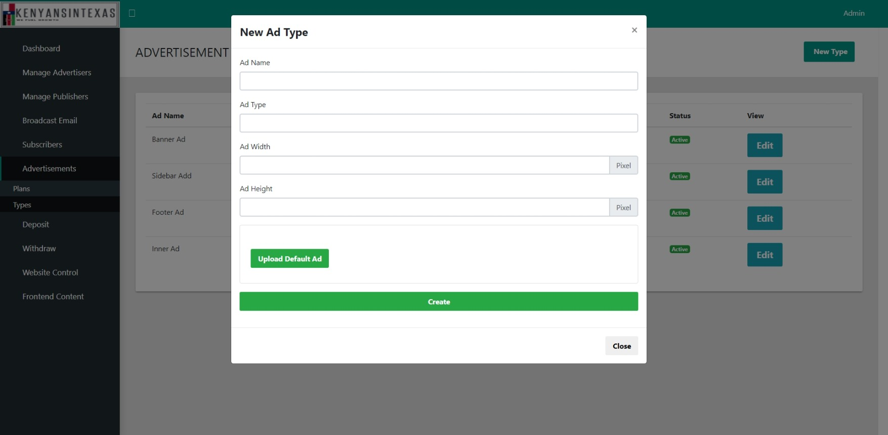

### 4.6 Deposit

#### 4.6.1 Deposits

This interface shows a table of records of payment made by Advertiser to KenyansInTexas account. The payment is initiated on the advertiser dashboard. Its status maybe pending if the advertiser has initiated payment but has not transfered the amount using the provided methods. It can be completed status when advertiser has transfered the amount to KenyansInTexas account.

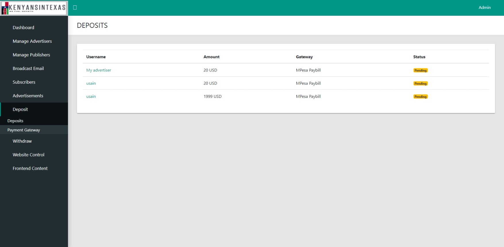

The table has these columns username, amount, gateway and status. The username column is clickable and when clicked, it opens the advertiser interface, described on the manage advertisers tab.

#### 4.6.2 Payment Gateway

The administrator can setup and activate multiple payment gateway that can be used to by advertisers to pay for the advertisement. This payment gateways are the most popular and most used on the web to make payments since they provide accessible APIs using web technologies. They include MPesa, Paypal, PerfectMoney, Stripe, Skrill, Blockchain.info, Block.io, Coinpayment  for payment using cryptocurrencies. 

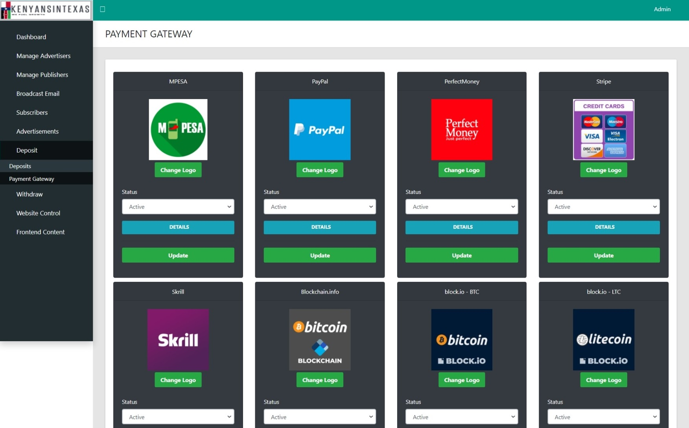

Each Payment gateway has a similar configuration procedure which administrator must include the relevant information. This include the `Name of the Gateway`, `Rate of conversion`, `Deposit limit(min-max amount)`, `Deposit charges by gateway`, `account name and number`. This information can also be updated later by clicking on the update button to save it securely on the database. 

### 4.7 Withdraw

#### 4.7.1 Withdraw  request

This interface displays a tabular layout of withdraw request by publishers. When publishers initiate a withdraw request and submits for approval, it is shown on this page.  The administrator can approve or disapprove. The columns include Username, Amount, Method, Account and Actions required for each row.

#### 4.7.2 Withdraw Log

This interface display a tabular layout of records of withdraw logs. When publisher request to withdraw is received and approved, a log is added to keep it for history purpose. The information included in this table is Username, Amount, Method, Account and Action 

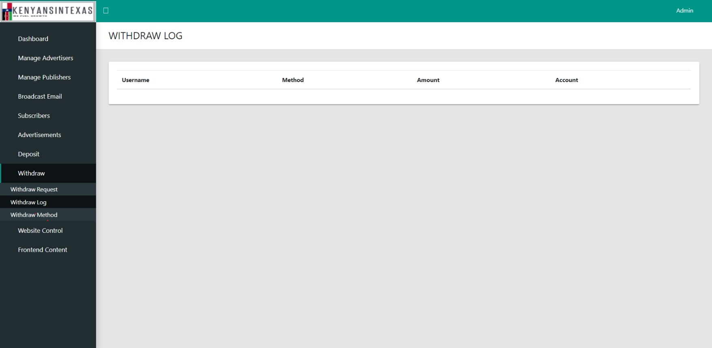

#### 4.7.3 Withdraw Method

The administrator can setup the payment gateways allowed to pay the publishers. The withdraw method must be most acceptable by publishers. The created withdraw methods are shown on this page. The administrator can update the information as required. This include the Name of the Gateway, Rate of conversion, Withdraw limit(min-max amount), Withdraw charges by gateway, Method details and Status. This information can also be updated later by clicking on the update button to save it securely on the database. 

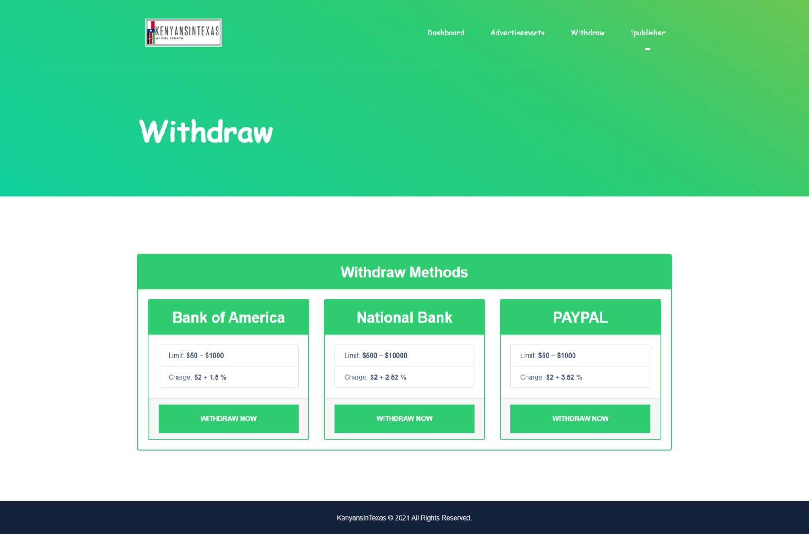

### 4.8 Website Control

#### 4.8.1 General Settings

The administrator cab be able to set some global values that are used in all pages. These includes: Website Title, Website sub-title or slogan, main theme color, Currency code, Currency Symbol, Number of decimals after the period, Cost Per View, Cost Per Click, Enable/Disable registration, Enable/Disable Email verification, Enable/Disable SMS verification, Email notification and SMS notification. This setting have default values when website is set up on the server but the administrator can update later.

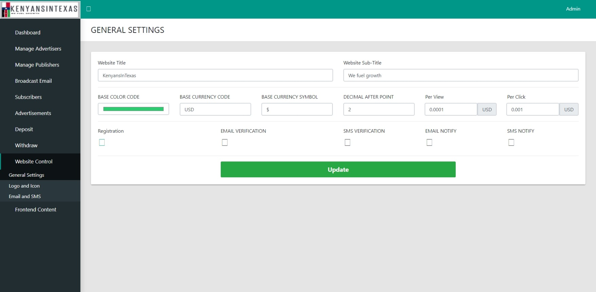 

#### 4.8.2 Logo and Icon

The administrator can change the website logo and icon on this interface. The images will be uploaded and all users will see the new changed logo and icon. Please note to check the correct dimensions and not to leave it blank which my display to the users who are active. 

#### 4.8.3 Template Settings

Email/SMS Templates are used when sending email newsletters, email promotions, email marketing or verification messages. Administrator can customize the default templates to a design that suites any requirements. The templates are are updated by clicking the update button below the 

 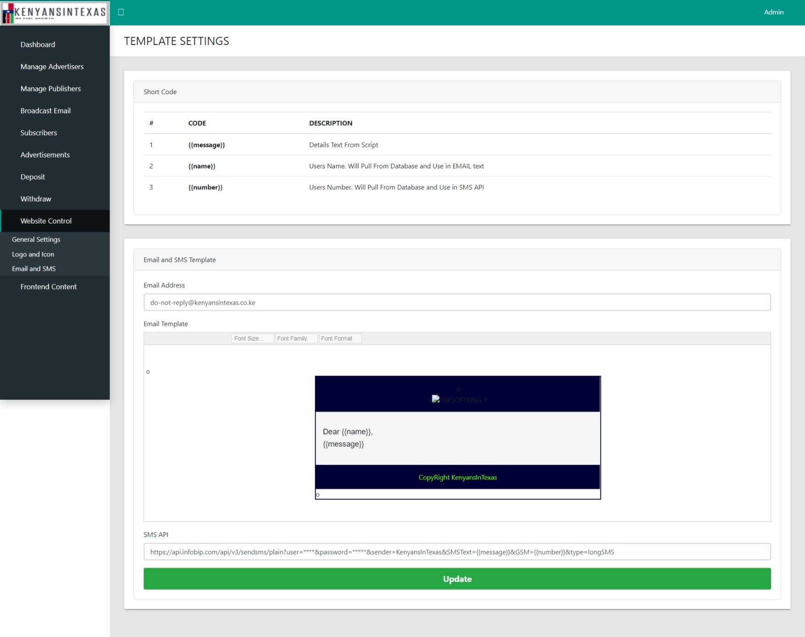

### 4.9 Frontend Content

#### 4.9.1 Banner Section

The administrator can set the jumbotron section heading, details, background photo and breadcrumb photo. You can change the current default values, upload the image files and  click on the update button to save the apply the changes.

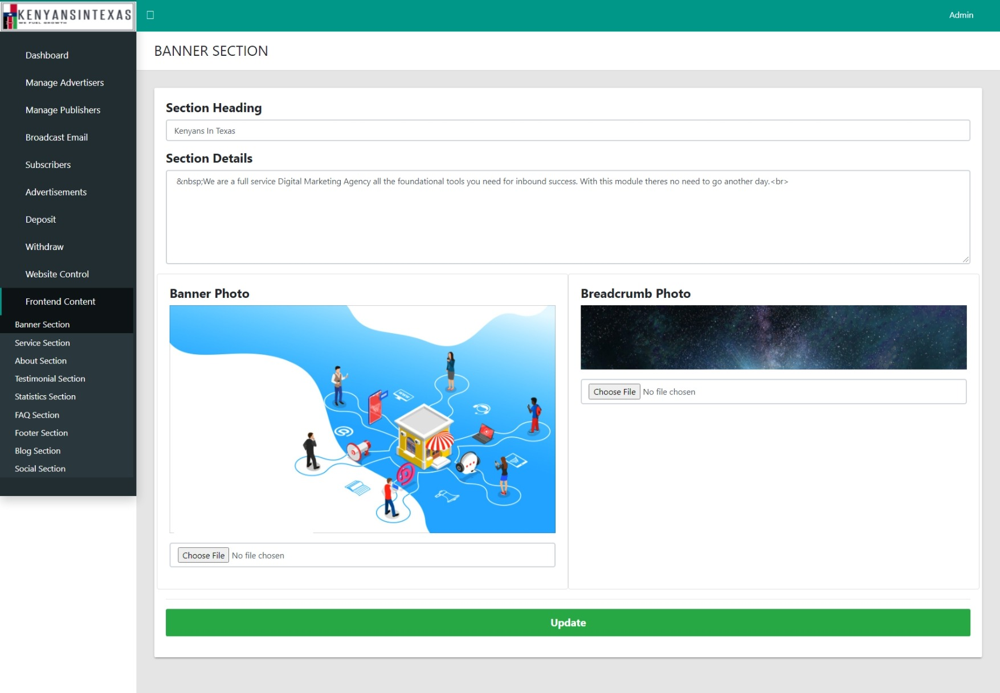

#### 4.9.2 Service Section

The service section on the homepage can be updated on this interface. The administrator can set the section heading, section details and create/edit/delete the services. New services can be added by clicking the button at the top. It pop-up a new view to add the heading and details.

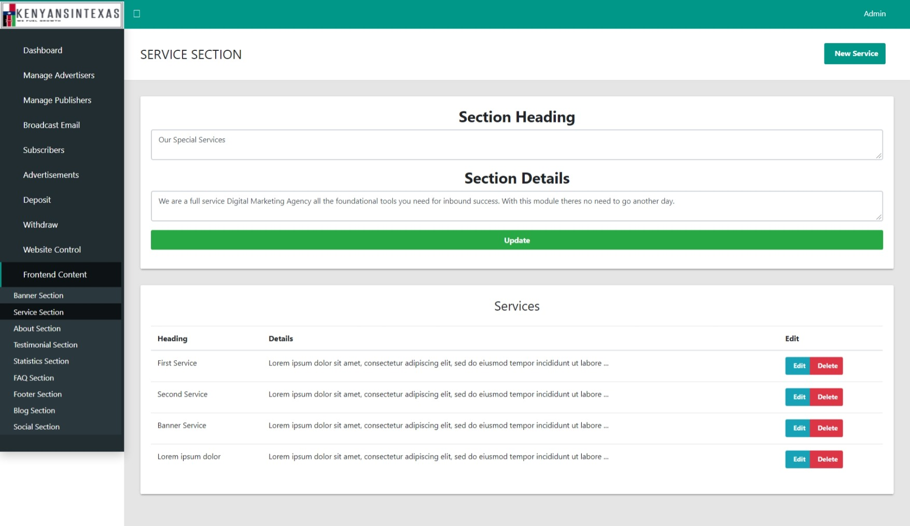

#### 4.9.3 About Section

The administrator can update the about section on the homepage. The about page has a heading, background photo, details and a video that opens in a pop-up view. The values can be updated on these interface. 

#### 4.9.4 Testimonial Section

The testimonial section on the homepage can be updated on this interface. The administrator can set the section heading, section details and create/edit/delete the testimonials. New testimonials can be added by clicking the button at the top. It pop-up a new view to add the heading and details.

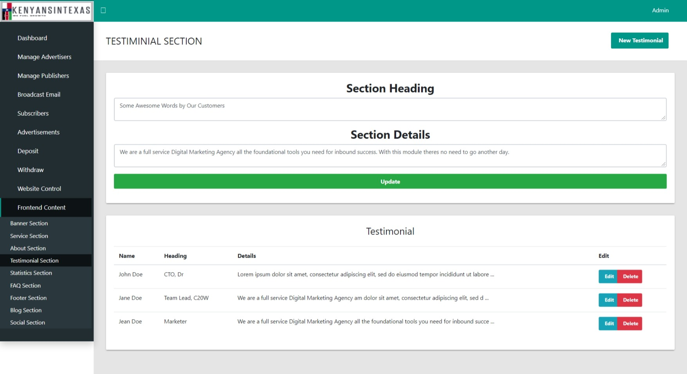

#### 4.9.5 Statistics Section

The statistics section on the homepage can be updated on this interface. The administrator can set the section heading, section details and values for the three boxes. The first box stores the number of global customers, the second has years of experience and third has daily advertisement served. 

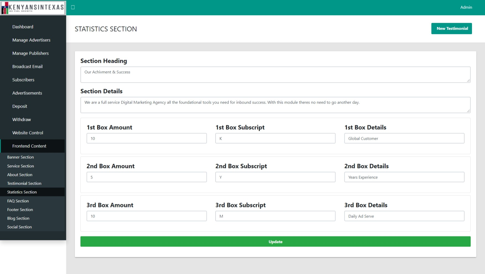

#### 4.9.6 FAQ section

The FAQ section on the about page can be updated on this interface. The administrator can set the section heading, section details and create/edit/delete the frequently asked questions. New FAQs can be added by clicking the button at the top. It pop-up a new view to add the heading and details.

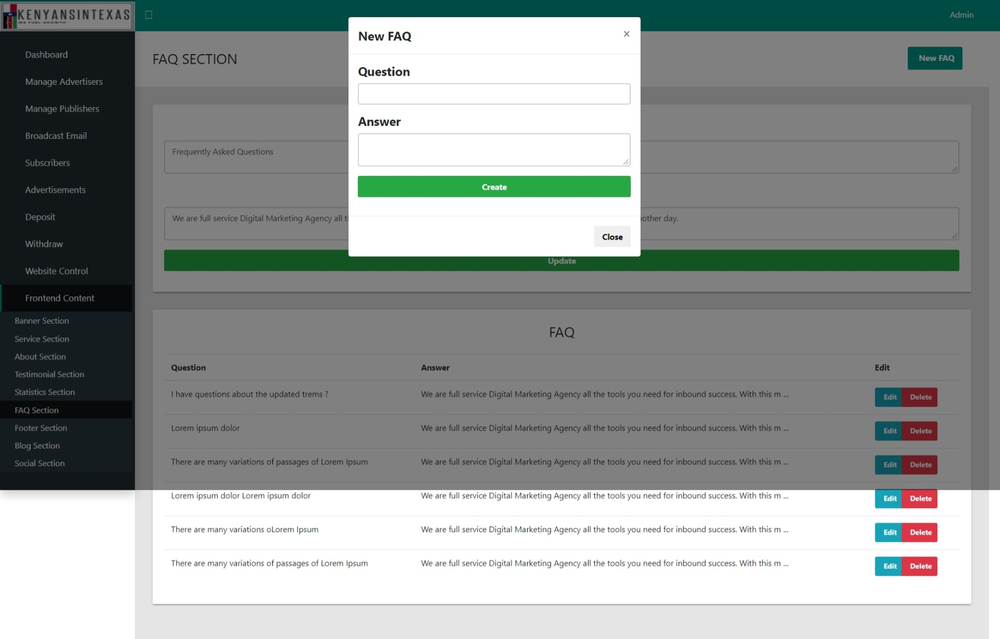

#### 4.9.7 Footer section

#### 4.9.8 Blog Section

The website has a blog page where administrator writes and publishes articles. In this section, administrator can add article photo, post heading and post details. The main page shows a list of create blog posts and on at the end of each row there's a button to edit or delete.  

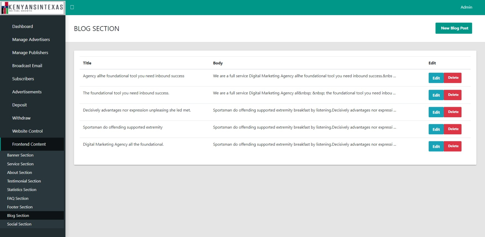

When administrator creates or edits a blog post it opens in the below interface. The photo, heading and body content can be updated by clicking on the update button below the page.

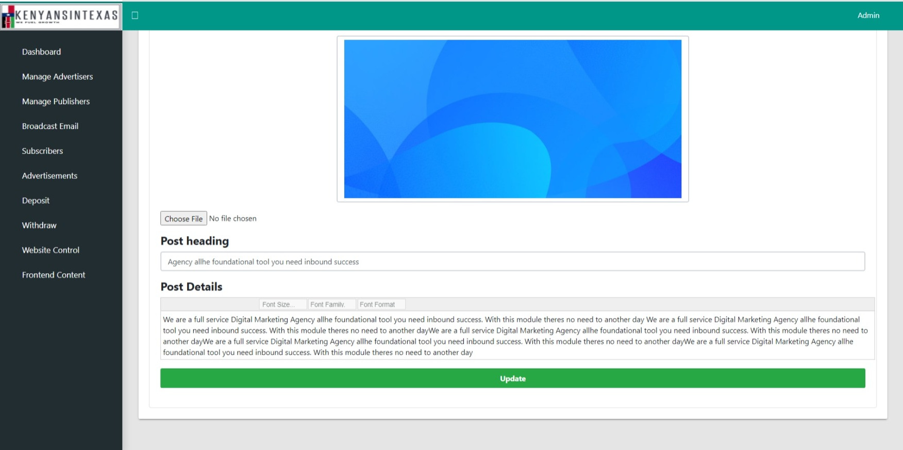

#### 4.9.9 Social Section

In this interface the administrator can add the social media links. These are URL links to social media accounts to KenyanInTexas. The default social media links are facebook, twitter and Linkedin accounts. However, administrator can add any other relevant social links.  

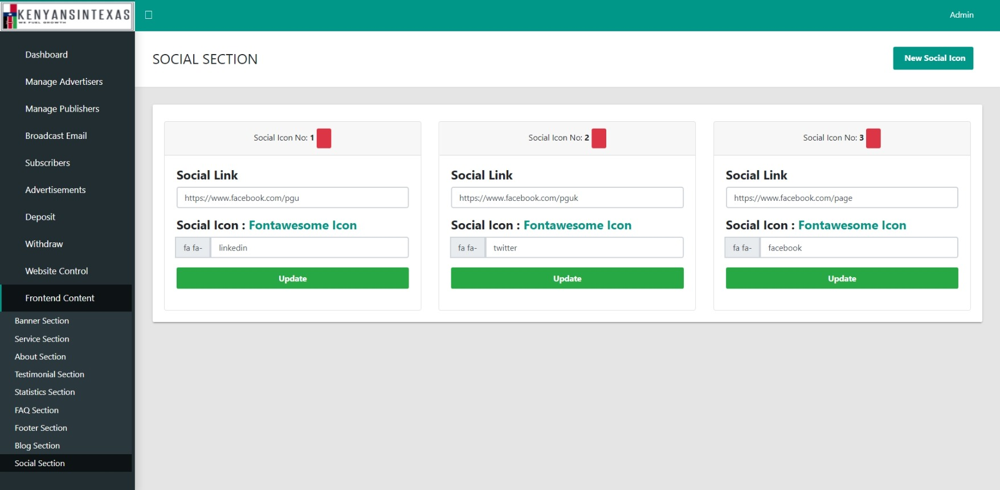

## 5. Advertiser Portal

### 5.1 Registration

To access must be registration using advertiser registration form. It can be accessed using `/register` URL which open the registration form. A user is required to provide `Name`, `username`, `email`, `country of origin`, `state or region`, `phone`, `password` and `confirm password`. 

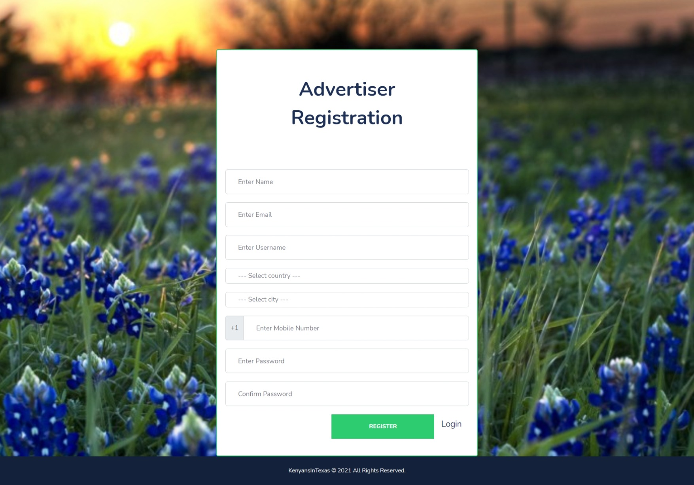

### 5.2 Login

After the registration, the user is redirected to login page using `/login` URL which opens advertiser login page. The user is expected to provide `username` and `password` . If its the first time the user will need to verify the email and phone using two factor authentication.

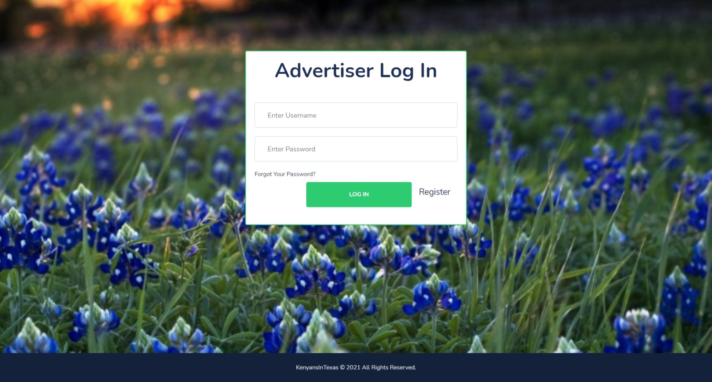

### 5.3 Dashboard

The main page on the advertiser interface is the dashboard. It tracks and displays values related to advertisement the advertiser has subscribed. These includes: `total impression`, `total clicked`, `view credit remaining` and `click credit remaining`. Total impression refers to number of times a web banner has been viewed on the web. These adds together the views on all impression advertisement type that advertiser has subscribed. Total clicked refers the number of times a web banner ad has been clicked on the web. These also adds together the clicks of all click advertisement type that advertiser has subscribed. The credit remaining on the impressions viewed and credit remaining on the clicked advertisements. 

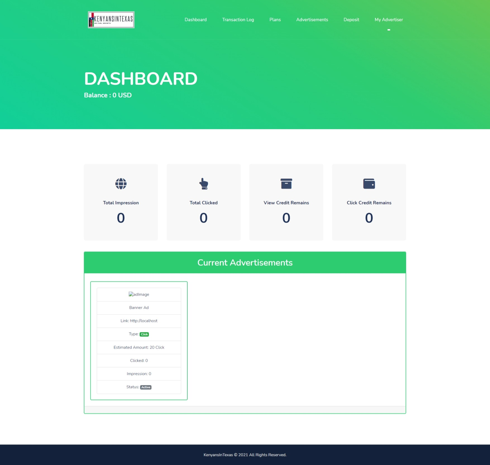

### 5.4 Profile

This page shows the advertiser information that includes: `Name`, `Email`, `Mobile`, `Country` and `City`. The advertiser can update this information by editing the field and clicking on the Update Profile button. The advertiser can also change the password by adding and confirming a new password.

### 5.5 Deposit

The advertiser has to deposit funds into his account to be able to buy advertisement credit. In this interface the different deposit methods are shown that an advertiser can choose. This deposit methods are created and configured by the administrator in the Deposit Tab, under payment gateways. When the advertiser click on the `Deposit Now` button on any of the method, it opens a pop-up view to `Enter Desposit amount` and clicks `Deposit Preview` it initiates the deposit payment. This open the deposit preview page and the total amount to be paid including overall charges. When advertiser clicks the `PAY NOW` button the gateway procedure of payment is initiated and API calls is initiated which redirects the web page to gateway payment authorization and actual money transfer. If the process is successful, the amount is transferred to KIT accounts and then displayed on the `Plans` tab

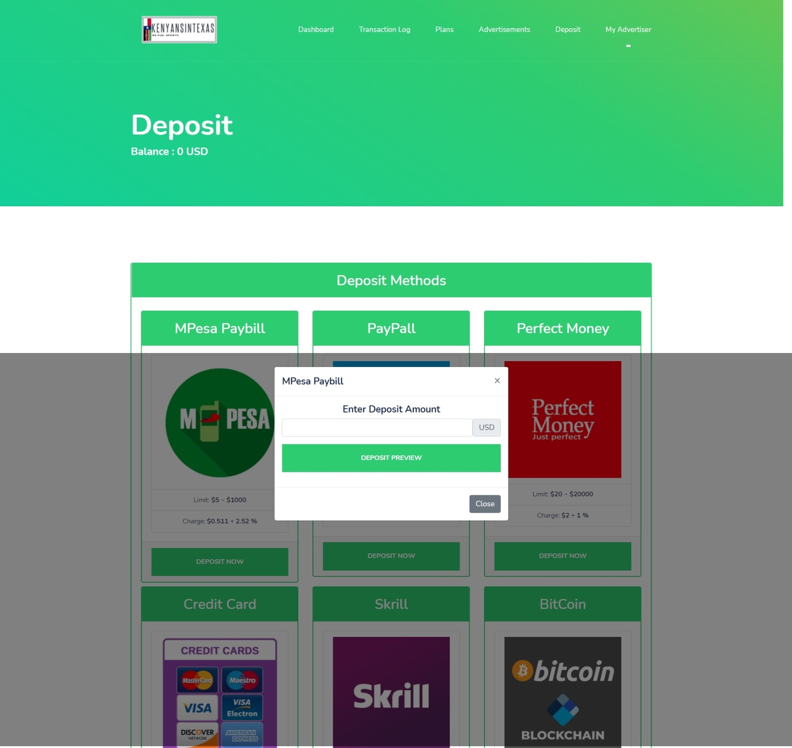

### 5.6 Advertisements

This page shows the type of advertisements the advertiser can create, either `Banner Ad`, `Sidebar Ad`, `Footer Ad` and `Inner Ad`. The advertiser can click the `create Ad` to create a new advert details which include `redirect URL`, `Ad type`, `Estimated amount of clicks/impression`, `upload image file of the ad`, `advertisement category`,`advertisement sub-category`, and the description of the advert. All the details are required and when `Create Ad` button is clicked the advertisement is added to the list of advertisers ads in the `Current Advertisements` table. The table columns includes: `Ad Type`, `Redirect URL`, `Ad Type`, `Estimated Amount`, `Clicked`, `Impression`, `Status` and `View`. Advertiser can create as many ads to fit all the needs. 

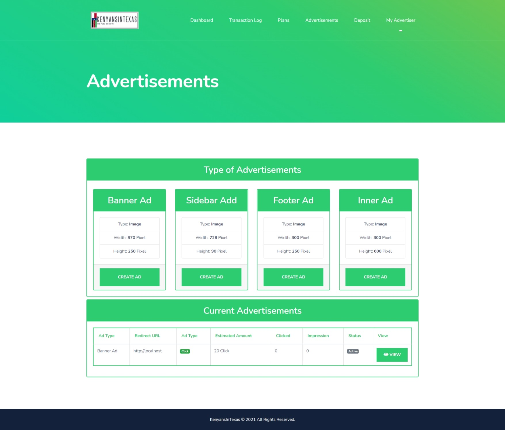

### 5.7 Plans

This interface shows the credit plans the administrator has created, Impression credit advertiser has bought, amount balance of the deposit and Clicks credit advertiser has purchased. The administrator creates a plan to target specific advertiser. If the advertiser is ineterested with a plan they can click on `Get Now` button to purchase the credit using the amount in the balance. 

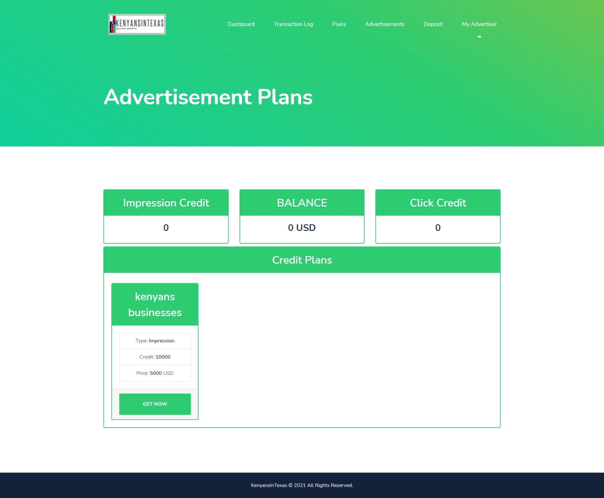

### 5.8 Transaction Logs

The deposit and credit purchases are recorded as transaction logs for history purpose. These can be easy for the advertiser to verify claims and track the credit use. The table has columns which include: `Amount`, `Balance`, `Details`, `Transaction ID` and `Transaction Time`. 

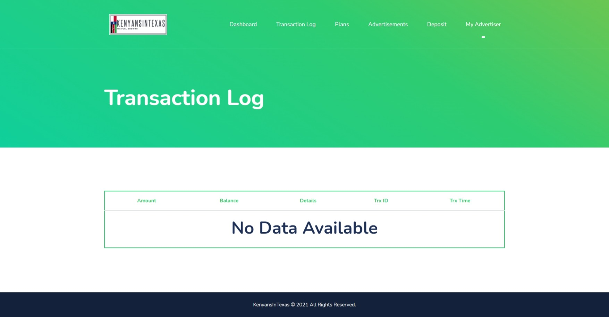

## 6. Publisher Portal

Publisher Websites those are connected with the advertisement system and  where advertisement will be displayed.

Use can make their advertisement with himself or he can also take helps of advertisement agency to create adv. After creating ads user can select any subscriber from list. Then user select any available plan for advertisement. After completing the payment users ads will be displayed on subscribers website. User can add as many subscribers as he want from the list.

### 6.1 Registration

To access must be registration using publisher registration form. It can be accessed using `/publisher` URL which open the registration form. A user is required to provide `Name`, `username`, `email`, `country of origin`, `state or region`, `phone`, `password` and `confirm password`. 

### 6.2 Login

After the registration, the publisher is redirected to login page using `/login` URL which opens publisher login page. The user is expected to provide `username` and `password` . If its the first time the publisher will need to verify the email and phone using two factor authentication.

### 6.3 Dashboard

The main page on the publisher interface is the dashboard to track `total impression`, `total clicked`, and `Earnings`. Total impression refers to number of times a web banner has been viewed on the web.  Total clicked refers the number of times a web banner ad has been clicked on the web. The amount of earning calculated using `CPV` or `CPC` using the rates set by administrator on the `general settings` tab .  There's also a table layout of the logs of all withdrawal transaction made by the publisher. The Details of the logs include `Amount`, `Method`, `Account`, `Status` and `TransactionTime`

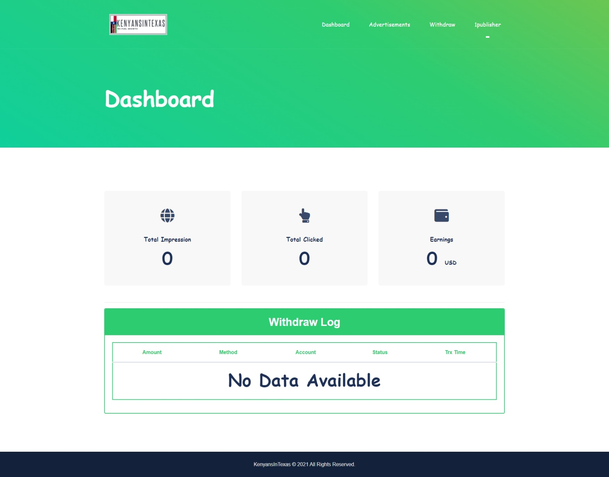

### 6.4 Profile

This page shows the publisher's information that includes: `Name`, `Email`, `Mobile`, `Country` and `City`. The publisher can update this information by editing the field and clicking on the Update Profile button. The publisher can also change the password by adding and confirming a new password.

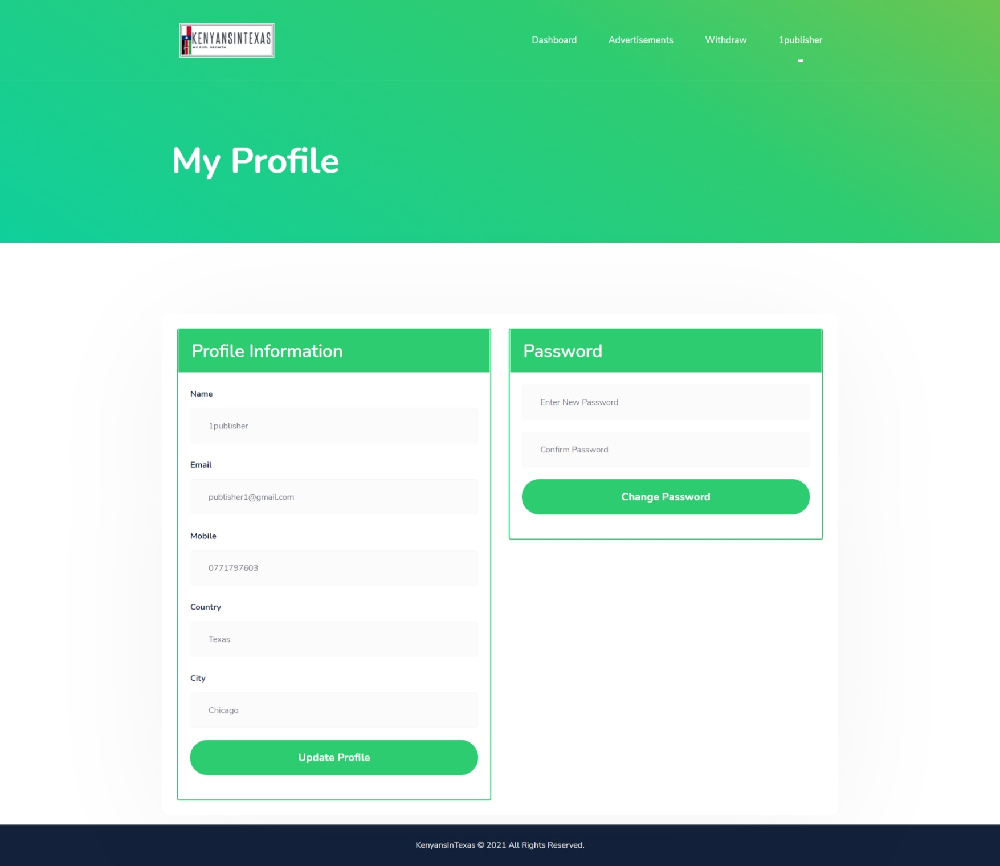

### 6.5 Withdraw

This page shows withdraw methods created by the administrator on the `Withdraw` tab under `Withdraw Methods`. These are payment gateways that KIT uses to payout the publishers the withdraw requests. Each with draw method has a limit amount that can be withdrawn and the transaction cost. When publisher select to withdraw using a specific method that can click on `WITHDRAW NOW` button, which opens a pop-up view to add amount and account to be sent to. These is added as a withdraw request and it can only be approved by the administrator. If the publisher account has enough amount to withdraw the amount will be transferred to the account specified. A transaction log is saved for history purpose for verification purpose.

### 6.6 Advertisements

This page shows the type of advertisements the publisher can create whether `Banner Ad`, `Sidebar Ad`, `Footer Ad` and `Inner Ad`. The  columns describe each advertisement type by either: `Ad Name`, `Ad Type`, `Ad Width`, `Ad height`, `script` and `Action`. A publisher can copy a script and place it on their web page to start receiving ads on their web page. The script has a unique number that identifies the publisher. 

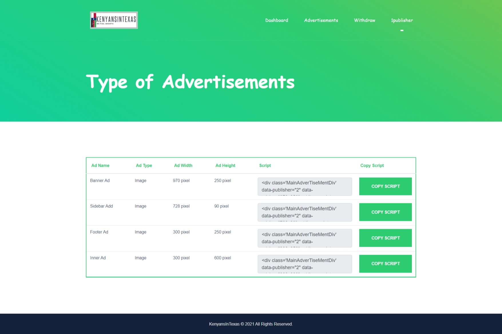

## 7.0 Members Portal

## Conclusion

KIT web is intended to generate revenue through advertisements for the owner and the publishers. Online advertising, and in particular social media, provides a low-cost means for advertisers to engage with large established communities for the advertisers. It provides a way collect data on advertisement effectiveness, how a visitor reached their advertisement, whether the advertisement resulted in a sale, and whether an ad actually loaded within a visitor's view. This helps online advertisers improve their ad campaigns over time. Publishers can offer advertisers the ability to reach customizable and narrow market segments for targeted advertising. Online advertising may use geo-targeting to display relevant advertisements to the user's geography. It can reach nearly every global market, and online advertising influences offline sales. Online ads can be deployed fast as soon as design is complete.

